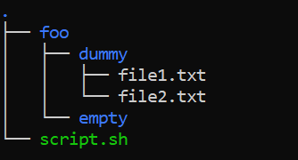

# Ejercicio 1

## Crea mediante comandos de bash la siguiente jerarquía de ficheros y directorios

```bash
foo/
├─ dummy/
│  ├─ file1.txt
│  ├─ file2.txt
├─ empty/
```

Donde `file1.txt` debe contener el siguiente texto:

```bash
Me encanta la bash!!
```

Y `file2.txt` debe permanecer vacío.

Para crear la siguiente estructura haremos uso de los siguientes comandos: 

```
mkdir -p foo/{dummy,empty} && echo Me encanta bash! > foo/dummy/file1.txt && touch foo/dummy/file2.txt
```
Para comprobar que hemos generado la estructura correctamente podemos hacer uso del comando `tree`:

