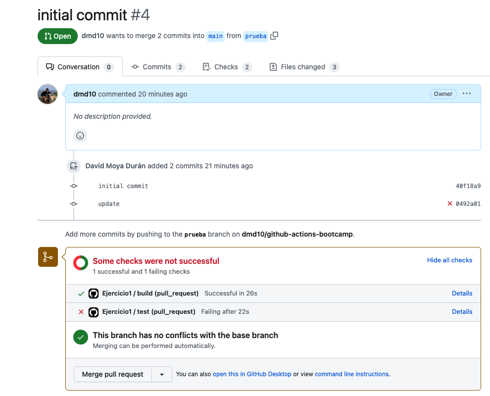
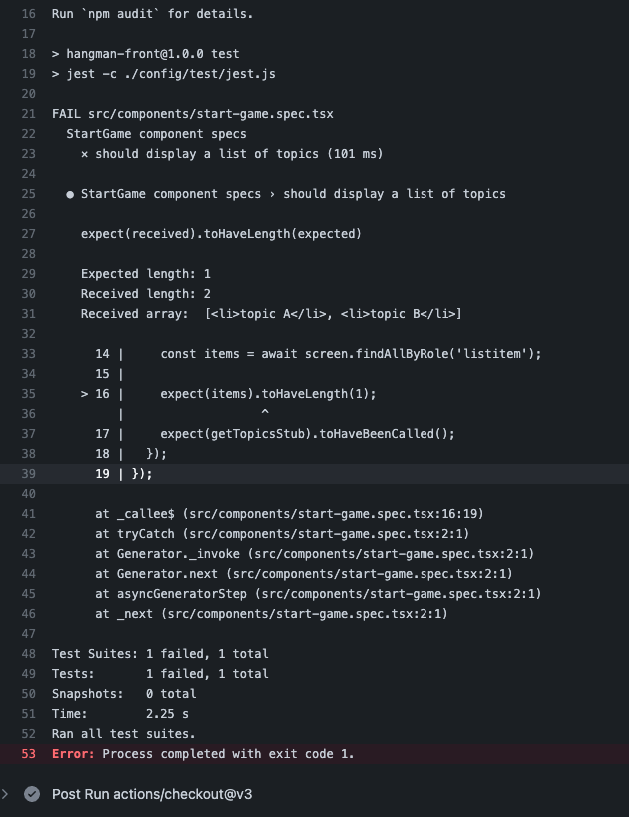

### Ejercicio 1. Crea un workflow CI para el proyecto de frontend

Copia el directorio [.start-code/hangman-front](../04-github-actions/.start-code/hangman-front) en el directorio raíz del proyecto. Después crea un nuevo workflow, que se disparé cuando exista una nueva pull request, y que ejecute las siguientes oeraciones:

* Build del proyecto de front
* Ejecutar los unit tests

#### Pasos a seguir:

1. Generamos un nuevo repositorio para las pruebas https://github.com/dmd10/github-actions-bootcamp.git

2. Copiamos el contenido de [.start-code/hangman-front](../04-github-actions/.start-code/hangman-front) en el nuevo repositorio:


3. Generamos una carpeta **.github/workflows** donde añadiremos el siguiente fichero **yml**:

```sh
name: Ejercicio1
on:
  pull_request:
    branches: [ main ] 
    paths: [ 'hangman-front/**' ]

jobs:
  build:
    runs-on: ubuntu-latest
    steps:
      - uses: actions/checkout@v3
      - name: Build
        working-directory: ./hangman-front
        run: |
          npm ci 
          npm run build --if-present

  test:
    runs-on: ubuntu-latest
    needs: build
    steps:
      - uses: actions/checkout@v3
      - name: test
        working-directory: ./hangman-front
        run: |
          npm ci
          npm test
```

4. Generemos una nueva **rama** en base a main, una vez hayamos generado esta nueva rama modificaremos parte del código como puede ser **.gitignore** con esto consegimos que haya una diferencía por lo tanto se ejecute nuestro **workflow**



Como podemos comprobar en los test nos marca un fallo en el código lo cual es un funcionamiento correcto.




