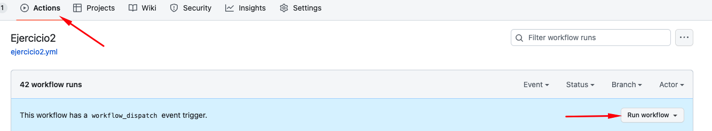
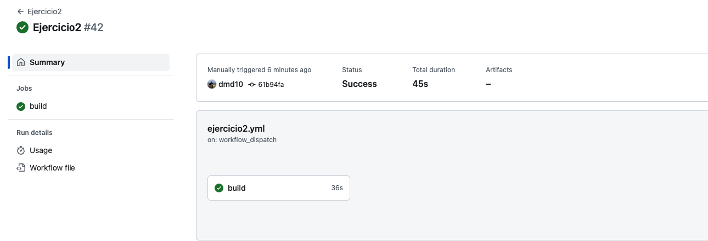
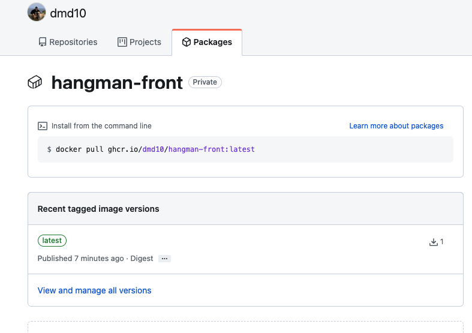

### Ejercicio 2. Crea un workflow CD para el proyecto de frontend

Crea un nuevo workflow que se dispare manualmente y que cree una nueva imagen de Docker y lo publique en el siguiente [registry](https://docs.github.com/en/packages/working-with-a-github-packages-registry/working-with-the-container-registry)

#### Pasos a seguir:

1. Generamos un nuevo repositorio para las pruebas https://github.com/dmd10/github-actions-bootcamp.git

2. Copiamos el contenido de [.start-code/hangman-front](../04-github-actions/.start-code/hangman-front) en el nuevo repositorio:


3. Generamos una carpeta **.github/workflows** donde añadiremos el siguiente fichero **yml**:

```sh
name: Ejercicio2

on:
  workflow_dispatch:

jobs:
  build:
    runs-on: ubuntu-latest
    steps:
      - uses: actions/checkout@v3
      - name: Login to Github Packages
        uses: docker/login-action@v2
        with:
          registry: ghcr.io
          username: ${{ github.actor }}
          password: ${{ secrets.SECRET_TOKEN }}
      - name: Build and push docker image
        uses: docker/build-push-action@v2
        with:
          context: ./hangman-front
          push: true
          tags: ghcr.io/dmd10/hangman-front:latest
```

4. Nos iremos a la pestaña **actions** para ejecutar manualmente dando click en **Run Workflow**




5. Como podemos comprobar se ejecuta correctamente el workflow y se sube la imagen.





