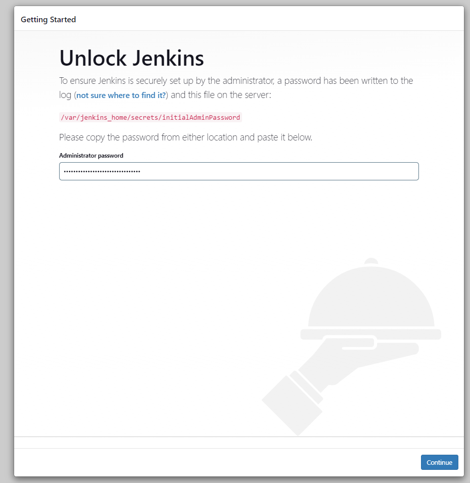
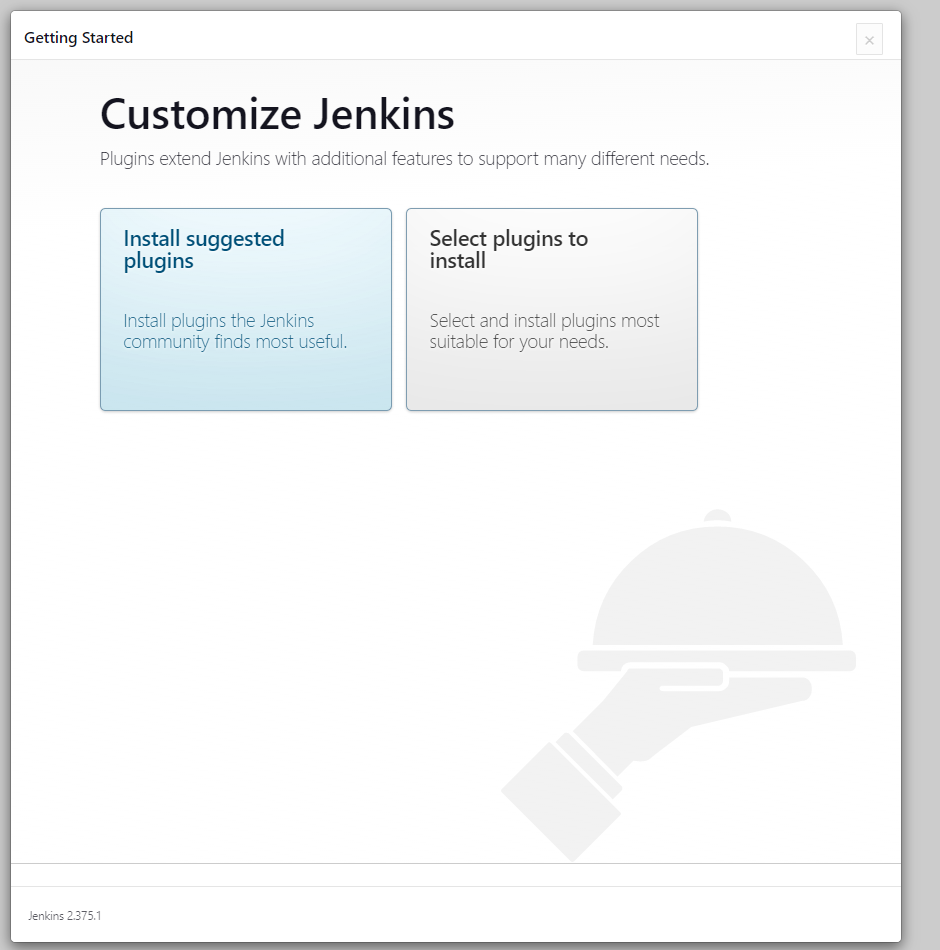
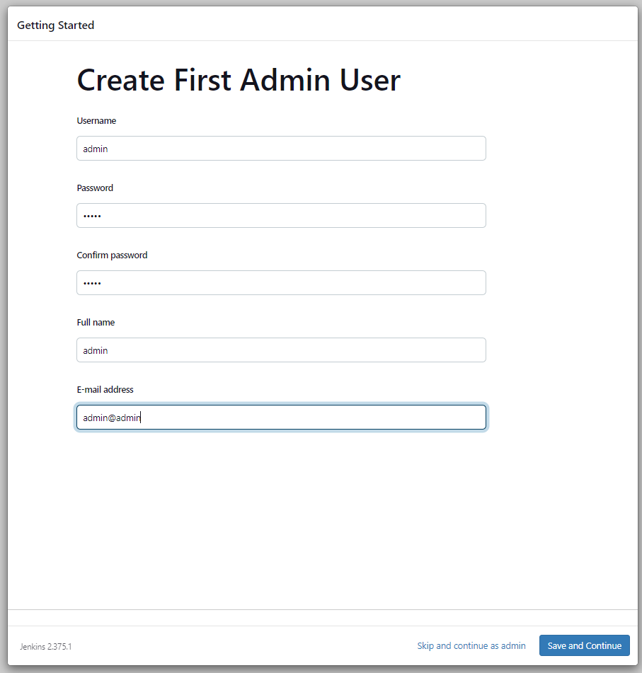
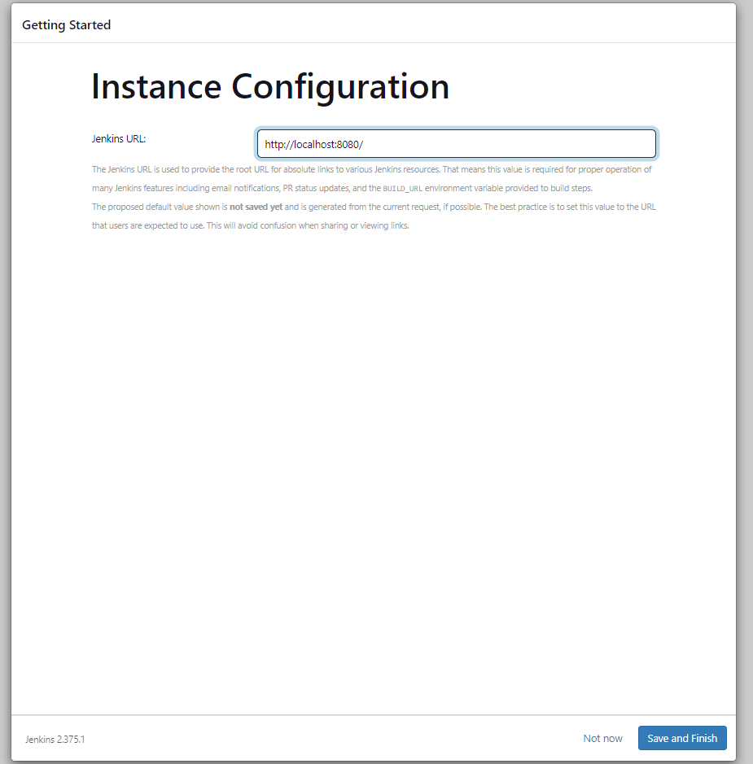
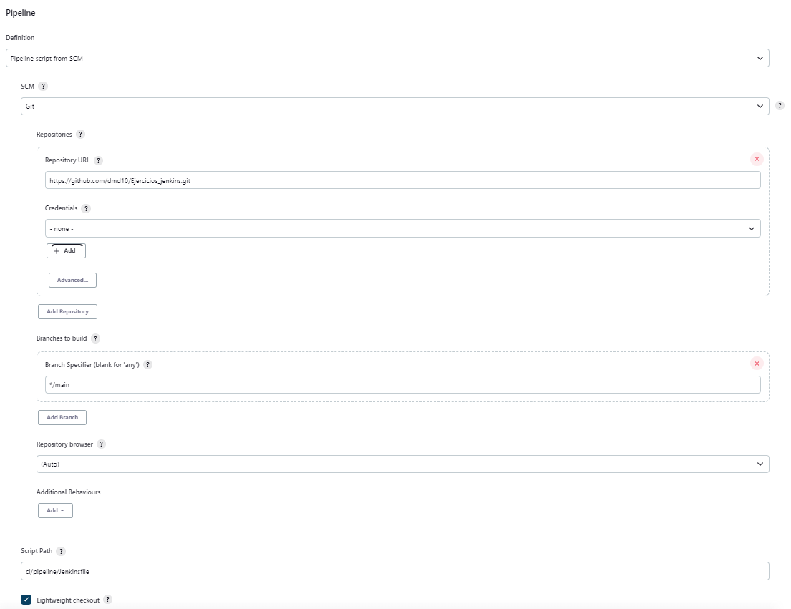
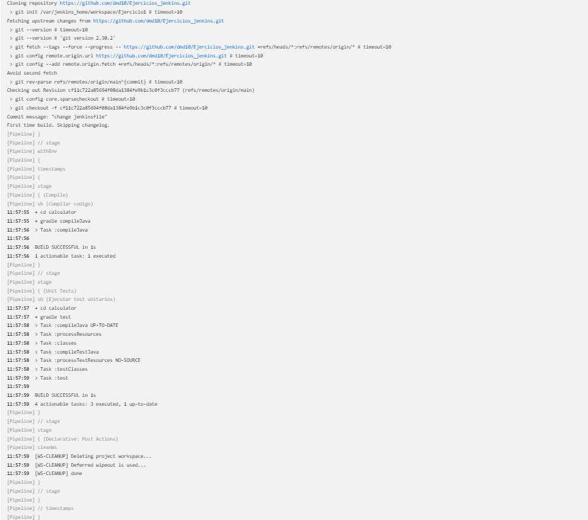

# EJERCICIO 1
## CI/CD de una Java + Gradle :
 
En el directorio raíz de este [código fuente](./Codigo/), crea un `Jenkinsfile` que contenga un pipeline declarativa con los siguientes stages:
 
* **Checkout** descarga de código desde un repositorio remoto, preferentemente utiliza GitHub.

  > No será necesario ya que es lo primero que realiza la pipeline por defecto

* **Compile** compilar el código fuente, para ello utilizar `gradlew compileJava`
* **Unit Tests** ejecutar los test unitarios, para ello utilizar `gradlew test`
 
Para ejecutar Jenkins en local y tener las dependencias necesarias disponibles podemos contruir una imagen a partir de [este Dockerfile](./Dockerfile)

### Pasos a seguir : 

Lo primero que deberemos hacer será generarnos una imagen de docker con el **Dockerfile** proporcionado para ello haremos uso del comando:

```properties
docker build . -t jenkinsgradle
```

Una vez tenemos creada nuestra imagen de Jenkins levantaremos el contenedor:  

```properties
docker run -dit --name jenkins -p 8080:8080 jenkinsgradle
```

Una vez iniciado el contenedor podremos acceder a el mediante la ruta **localhost:8080** y nos saldrá la siguiente ventana donde deberemos introduccir la contraseña que nos proporcionan.


> En los **logs** del contenedor podremos ver la contraseña que deberemos añadir al iniciar Jenkins.



Una vez tengamos añadida la contraseña se nos abrirá una nueva ventana para customizar nuestro Jenkins como podemos ver en la siguiente imagen, donde deberemos dar en **Install suggested plugins** para que nos instale los plugins más utilizados y que nos pueden hacer falta a posteriori.




Una vez se hayan instalado todos los plugins nos aparecerá la siguiente ventana donde deberemos elegir el username, password, etc 



Una vez demos en **Save and Continue** nos saldrá está nueva configuración, que deberemos dejarlo tal y como está: 



Ya podremos hacer uso de nuestro **Jenkins**

---
#### Generar Repositorio 
Para el ejercicio que queremos hacer deberemos generar un repositorio en github, será el que contenga el código de la aplicación que queremos compilar y posteriormente hacer test. 
- Iniciamos sesión en GitHub.
- Creamos un nuevo repositorio público (para hacerlo más sencillo sin tener que generar credenciales).
- Nos clonamos el repositorio.
- Copiamos el código que se nos ha proporcionado al repositorio clonado.

---
#### Generar Pipeline
Para ello en el repositorio que hemos clonado deberemos generar una carpeta **ci/pipeline** donde generaremos nuestro **Jenkinsfile** que contendrá el siguiente código:

```properties
pipeline {
    agent any 
        
    options {
        timestamps()
        disableConcurrentBuilds()
    }
    
    stages {
        stage ('Compile') {
            steps {
              sh label: 'Compilar codigo', script: 'cd calculator && gradle compileJava'
            }        
        }

        stage ('Unit Tests') {
            steps {
              sh label: 'Ejecutar test unitarios', script: 'cd calculator && gradle test'
            }
        }
    }
      post {
        cleanup {
            //Clean Workspace
            cleanWs()
        }
    }
}

```

---
#### Pipeline en Jenkins
Una vez hayamos realizado estos pasos deberemos configurar un nuevo **item** de tipo **pipeline** donde deberemos añadir:
- URL del repositorio
- Branch
  > Tener en cuenta que por defecto viene como master y en nuestro caso la rama es main.
- Script Path donde pondremos la ruta donde se encuentra nuestro Jenkinsfile



Una vez realizado estos pasos guardaremos la configuración y daremos click en **Build Now**, podremos ver el proceso desde el **Console Output** como podemos ver en la siguiente imagen:




