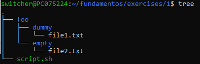

# Ejercicio 2
## Mediante comandos de bash, vuelca el contenido de file1.txt a file2.txt y mueve file2.txt a la carpeta empty

El resultado de los comandos ejecutados sobre la jerarquía anterior deben dar el siguiente resultado.

```bash
foo/
├─ dummy/
│  ├─ file1.txt
├─ empty/
  ├─ file2.txt
```

Donde `file1.txt` y `file2.txt` deben contener el siguiente texto:

```bash
Me encanta la bash!!
```

Para realizar lo siguiente haremos uso de los siguientes comandos: 

```
cat foo/dummy/file1.txt > foo/dummy/file2.txt && mv foo/dummy/file2.txt foo/empty/
```
Para comprobar que hemos generado la estructura correctamente podemos hacer uso del comando `tree`:

