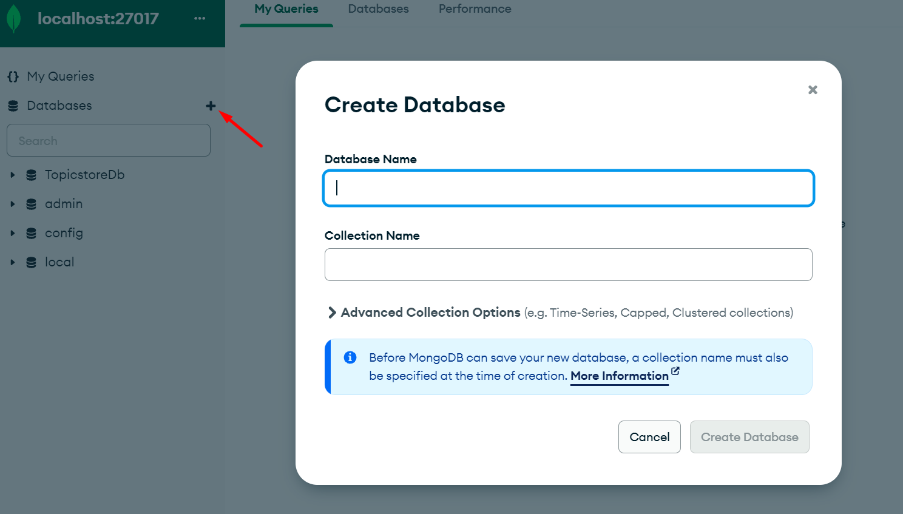

# Bootcamp Devops III - Bootcamp Devops III - Modulo 2 Docker

## Ejercicio 1

Dockeriza la aplicación dentro de lemoncode-challenge, la cual está compuesta de 3 partes:

- Un front-end con Node.js
- Un backend en .NET que utiliza un MongoDB para almacenar la información.
- El MongoDB donde se almacena la información en una base de datos.

### PASOS A SEGUIR:

#### Generar Red Contenedores :
- Los tres componentes deben estar en una red llamada **lemoncode-challenge** por lo tanto deberemos generarla para ello deberemos ejecutar el siguiente comando: 

  ```properties
  docker network create lemoncode-challenge
  ```

- Esta **network** que acabamos de generar la podemos usar como en este ejemplo:
  
  ```properties
  docker run -dit --name [container-name] --networ k lemoncode-challenge [imagen-name]
  ```
---
#### Comunicación Front con Back : 
- El backend debe comunicarse con el mongodb a través de esta URL mongodb://some-mongo:27017

  En la carpeta **./backend** tendremos un fichero **appsettings.json** en el que deberemos modificar **localhost** por **some-mongo**.  

  "ConnectionString": "mongodb://localhost:27017", quedará de la siguiente manera: 

  ```properties 
  "ConnectionString": "mongodb://some-mongo:27017",
  ```

- El front-end debe comunicarse con la api a través de http://topics-api:5000/api/topics


  En la carpeta **./frontend** tendremos un fichero **server.js** en el que deberemos modificar **localhost** por **topics-api**.

  const LOCAL = 'http://localhost:5000/api/topics'; quedará de la siguiente manera: 

  ```properties
  const LOCAL = 'http://topics-api:5000/api/topics';
  ```
---
#### Mapear Front 
- El front-end debe estar mapeado con el host para ser accesible a través del puerto 8080.

  Para ello en el **Dockerfile** deberemos exponer el puerto **3000** y una vez vayamos a lenvantar el contenedor el comando será el siguiente:

  ```properties
  docker run -dit --name frontend -p 8080:3000 -e API_URI=http://topics-api:5000/api/topics --network lemoncode-challenge frontend
  ```
---
#### Volumen MongoDB :
- El MongoDB debe almacenar la información que va generando en un volumen, mapeado a la ruta /data/db.

- Lo primero que deberemos hacer será generar el volumen que posteriormente asociaremos al contentedor: 
  ```properties
  docker volume create mongodb
  ```
- Ya que no tenemos la imagen de mongo deberemos hacernos un pull de la imagen de mongo de la siguiente forma:
  ```properties
  docker pull mongo
  ```
- Una vez tengamos descargado la imagen de mongo deberemos iniciar el contenedor con el siguiente comando:
  ```properties
  docker run -dit --name some-mongo -p 27017:27017 -v mongodb:/data/db --network lemoncode-challenge mongo
  ```
---
#### Generar Base de Datos :
- Este debe de tener una base de datos llamada TopicstoreDb con una colección llamada Topics. La colección Topics debe tener esta estructura: 

  **{"_id":{"$oid":"5fa2ca6abe7a379ec4234883"},"Name":"Contenedores"}**

  Para añadir varios registros haremos uso de la app **MongoDbCompass**, entraremos al contenedor de la base de datos e introduciremos los datos de la siguiente manera:

  >**Conectar a base de datos:**

  

  >**Crear base de datos:**

  

  >**Insertar datos:**
  
  

---
#### Generar Dockerfiles
> Frontend
  ```properties
    FROM mcr.microsoft.com/dotnet/sdk:3.1

    WORKDIR /App

    COPY . .

    CMD ["dotnet", "run"]
  ```
> Backend
  ```properties
    FROM node:16

    WORKDIR /app

    COPY package*.json ./

    RUN npm install

    COPY . .

    EXPOSE 3000

    CMD ["npm", "start"]
  ```

---
#### Generar Imagenes Docker
Para generar las imagenes docker haremos uso de los **Dockerfiles**, para ello deberemos estar en la carpeta **frontend** si queremos generar la imagen de front o **backend** si queremos generar la imagen de backend. Sabiendo esto para generar nuestra imagen haremos uso del comando:

  ```properties
    docker build . -t [imagen-name]:[tag]
  ```

Por lo tanto en mi caso he usado estos dos comandos:

  ```properties
    docker build . -t frontend

    docker build . -t backend 
  ```


---
## Ejercicio 2

Ahora que ya tienes la aplicación del ejercicio 1 dockerizada, utiliza Docker Compose para lanzar todas las piezas a través de este. Debes plasmar todo lo necesario para que esta funcione como se espera: 
- Red que utilizan 
- Volumen que necesita MongoDB 
- Variables de entorno
- Puerto que expone la web y la API. 

Además indico los comandos para levantar el entorno, pararlo o eliminarlo.

---
### Pasos a seguir:

Deberemos generar un archivo llamado docker-compose.yml el cual contendrá el siguiente código:

```properties

```

Una vez tengamos generado nuestro archivo para **levantar** el entorno deberemos hacer uso del comando: 

```properties
docker-compose up docker-compose.yml
```

Si queremos **pararlo**:

```properties
docker-compose down docker-compose.yml
```

Como última opción, si queremos **eliminarlo:**
```properties
docker-compose rm docker-compose.yml
```

