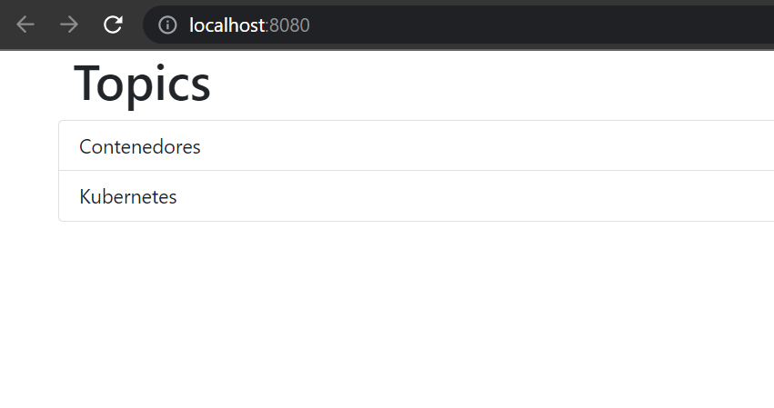

# Bootcamp Devops III - Bootcamp Devops III - Modulo 2 Docker

## Ejercicio 1

Dockeriza la aplicación dentro de lemoncode-challenge, la cual está compuesta de 3 partes:

- Un front-end con Node.js
- Un backend en .NET que utiliza un MongoDB para almacenar la información.
- El MongoDB donde se almacena la información en una base de datos.

### Pasos a seguir:

1. Los tres componentes deben estar en una red llamada lemoncode-challenge.
Para generar la nueva red llamada **lemoncode-challenge** deberemos ejecutar el siguiente comando: 

```bash
docker network create lemoncode-challenge
```

2. El backend debe comunicarse con el mongodb a través de esta URL mongodb://some-mongo:27017
En la carpeta ./backend tendremos un fichero **appsettings.json** en el que deberemos modificar **localhost** por **some-mongo**  "ConnectionString": "mongodb://localhost:27017", quedando de la siguiente manera: 
```bash
"ConnectionString": "mongodb://some-mongo:27017",
```

3. El front-end debe comunicarse con la api a través de http://topics-api:5000/api/topics
En la carpeta ./frontend tendremos un fichero **server.js** en el que deberemos modificar **localhost** por **topics-api**  const LOCAL = 'http://localhost:5000/api/topics'; quedando de la siguiente manera: 
```bash
const LOCAL = 'http://topics-api:5000/api/topics';
```

4. El front-end debe estar mapeado con el host para ser accesible a través del puerto 8080.
Para ello en el Dockerfile deberemos exponer el puerto 3000 y una vez vayamos a lenvantar el contenedor el comando será el siguiente:
´´´bash
docker run -dit --name frontend -p 8080:3000 -e API_URI=http://topics-api:5000/api/topics --network lemoncode-challenge frontend
´´´

5. El MongoDB debe almacenar la información que va generando en un volumen, mapeado a la ruta /data/db.
Lo primero que deberemos hacer será generar el volumen que posteriormente asociaremos al contentedor: 
´´´bash
docker volume create mongodb
´´´
En este paso deberemos hacernos un pull de la imagen de mongo de la siguiente forma:
´´´bash
docker pull mongo
´´´
Una vez tengamos descargado la imagen de mongo deberemos iniciar el contenedor con el siguiente comando:
´´´bash
docker run -dit --name some-mongo -p 27017:27017 -v mongodb:/data/db --network lemoncode-challenge mongo
´´´

6. Este debe de tener una base de datos llamada TopicstoreDb con una colección llamada Topics. La colección Topics debe tener esta estructura: {"_id":{"$oid":"5fa2ca6abe7a379ec4234883"},"Name":"Contenedores"} ¡Añade varios registros!

Para ello 

**Realizamos las siguientes comprobaciones:**
Comprobar que el front funciona de forma correcta


## Ejercicio 2

Ahora que ya tienes la aplicación del ejercicio 1 dockerizada, utiliza Docker Compose para lanzar todas las piezas a través de este. Debes plasmar todo lo necesario para que esta funcione como se espera: la red que utilizan, el volumen que necesita MongoDB, las variables de entorno, el puerto que expone la web y la API. Además debes indicar qué comandos utilizarías para levantar el entorno, pararlo y eliminarlo.

### Pasos a seguir:

Una vez hayamos realizado todos estos pasos si realizamos una consulta ```bash kubectl get svc ``` donde nos mostrará lo siguiente:


Esto nos mostrará la ip y en nuestro navegador podremos hacer la prueba accediendo a 127.0.0.1:3000 mostrandonos lo que vemos a continuación:


