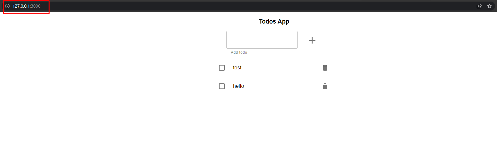

# Monolito en memoria

## Enunciado

Construir los distintos recursos de Kubernetes para generar un clúster, como el de la siguiente imagen:


### Para ello seguir los siguientes pasos:

### Paso 1. Crear todo-app

Crear un `Deployment` para `todo-app`, usar el `Dockerfile` de este direetorio **todo-app**, para generar la imagen necesaria.

Al ejecutar un contenedor a partir de la imagen anaterior, el puerto por defecto es el 3000, pero se lo podemos alimentar a partir de  variables de entorono, las variables de entorno serían las siguientes

* **NODE_ENV** : El entorno en que se está ejecutando el contenedor, nos vale cualquier valor que no sea `test`
* **PORT** : El puerto por el que va a escuchar el contenedor.

### Paso 2. Acceder a todo-app desde fuera del clúster

Crear un `LoadBalancer service` para acceder al `Deployment` anteriormente creado desde fuera del clúster. Para poder utilizar un `LoadBalancer` con minikube seguir las instrucciones de este [artículo](https://minikube.sigs.k8s.io/docs/handbook/accessing/)

## Pasos a seguir:
### Generar imagen docker 
En mi caso he clonado vuestro repositorio https://github.com/Lemoncode/bootcamp-devops-lemoncode.git, una vez estemos posicionados en el siguiente directorio **bootcamp-devops-lemoncode/02-orquestacion/exercises/00-monolith-in-mem/todo-app/** deberemos ejecutar el comando para generar la imagen a partir del dockerfile: 
```bash
docker build -t todoapp .
```

### Añadir imagen docker a minikube
Por otro lado todas estas pruebas las estoy realizando en minikube, dado que al tener la imagen generada en local tenemos este comando de minikube que añade la imagen para poder trabajar con ella:
```bash
minikube image load todoapp
```
### Minikube tunnel
Para poder hacer uso de un service tipo LoadBalancer deberemos ejecutar el comando:
```bash
minikube tunnel
```
### Generar deployment.yml y aplicar.
En este paso deberemos tener en cuenta añadir los env que vamos a mandar a nuestro container y añadir imagePullPolicy: Never para que no intente descargar dicha imagen de ningún repositorio.
```bash
apiVersion: apps/v1
kind: Deployment
metadata:
  name: todoapp
spec:
  selector:
    matchLabels:
      app: todoapp
  template:
    metadata:
      name: todoapp 
      labels:
        app: todoapp
    spec:
      containers:
      - name: main
        image: todoapp
        imagePullPolicy: Never
        env:
          - name: NODE_ENV
            value: "production"
          - name: PORT
            value: "3000"
```
Para aplicar este deploy en nuestro cluster de minikube deberemos usar el comando:
```bash
kubectl apply -f deployment.yml
```
### Generar loadbalancer.yml
Por último deberemos crear un servicio tipo loadbalancer teniendo en cuenta poner los puertos de forma correcta.
```bash
apiVersion: v1
kind: Service
metadata:
  name: todoapp
spec:
  selector:
    app: todoapp 
  ports:
  - port: 3000
    targetPort: 3000
  type: LoadBalancer
```

Una vez hayamos realizado todos estos pasos si realizamos una consulta ```bash kubectl get svc ``` donde nos mostrará lo siguiente:


Esto nos mostrará la ip y en nuestro navegador podremos hacer la prueba accediendo a 127.0.0.1:3000 mostrandonos lo que vemos a continuación:


