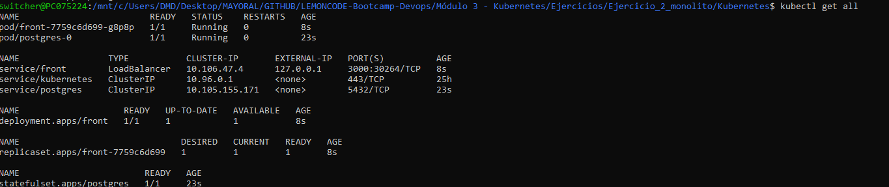

# Monolito

## Enunciado

Construir los distintos recursos de Kubernetes para generar un clúster, como el de la siguiente imagen:


### Para ello seguir los siguientes pasos:

### Paso 1. Crear una capa de persistencia de datos

Crear un `StatefulSet` para tener una base de datos dentro del cluster, para ello generar los siguientes recursos: 

* Crear un `ConfigMap` con la configuración necesaria de base de datos
* Crear un `StorageClass` para el aprovisionamineto dinámico de los recursos de persistencia
* Crear un `PersistentVolume` que referencie el `StorageClass` anterior
* Crear un `PersistentVolumeClaim` que referencie el `StorageClass` anterior
* Crear un `Cluster IP service`, de esta manera los pods del `Deployment` anterior serán capaces de llegar al `StatefulSet`
* Crear el `StatefulSet` alimentando las variables de entorno y el volumen haciendo referencia al `PersistentVolumeClaim` creado anteriormente.

Una vez tengamos nuestro `StatefulSet` corriendo la manera más directa de generar la base de datos sería:

* Ejecutamos `kubectl get pods`, y obtenemos el nombre del pod relacionado con el `StatefulSet`.
* Ejecutamos `kubectl exec [postgres-pod-name] -it bash`
* Ejecutamos `psql -U postgres`, pegamos `todo-app/todos_db.sql` y pulsamos `enter`, la base de datos debería estar generada

### Paso 2. Crear todo-app

Crear un `Deployment` para `todo-app`, usar el `Dockerfile` de este direetorio **todo-app**, para generar la imagen necesaria.

Al ejecutar un contenedor a partir de la imagen anaterior, el puerto por defecto es el 3000, pero se lo podemos alimentar a partir de  variables de entorono, las variables de entorno serían las siguientes

* **NODE_ENV** : El entorno en que se está ejecutando el contenedor, nos vale cualquier valor que no sea `test`
* **PORT** : El puerto por el que va a escuchar el contenedor
* **DB_HOST** : El host donde se encuentra la base de datos
* **DB_USER**: El usuario que accede a la base de datos, podemos usar el de por defecto `postgres`
* **DB_PASSWORD**: El password para acceeder a la base de datos, podemos usar el de por defecto `postgres`
* **DB_PORT** : El puerto en el que postgres escucha `5432`
* **DB_NAME** : El nombre de la base de datos, en `todo-app/todos_db.sql`, el script de inicialización recibe el nombre de `todos_db`
* **DB_VERSION** : La versión de postgres a usar, en este caso `10.4`

Crear un `ConfigMap` con todas las variables de entorno, que necesitarán los pods de este `Deployment`.

> NOTA: Las obligatorias son las de la base de datos, todas aquellas que comienzan por `DB`
### Paso 3. Acceder a todo-app desde fuera del clúster

Crear un `LoadBalancer service` para acceder al `Deployment` anteriormente creado desde fuera del clúster. Para poder utilizar un `LoadBalancer` con minikube seguir las instrucciones de este [artículo](https://minikube.sigs.k8s.io/docs/handbook/accessing/)

## Pasos a seguir:
### Generar imagenes docker 
En mi caso he clonado vuestro repositorio https://github.com/Lemoncode/bootcamp-devops-lemoncode.git, una vez estemos posicionados en el siguiente directorio **bootcamp-devops-lemoncode/02-orquestacion/exercises/01-monolith-in-mem/todo-app/** deberemos ejecutar el comando para generar la imagen a partir del dockerfile:

**Generar imagen docker para base de datos:**
```bash
docker build -t todoappdb -f Dockerfile. .
```
**Generar imagen docker para frontend:**
```bash
docker build -t todoapp -f Dockerfile.todos_db .
```
### Añadir imagenes docker a minikube
Por otro lado todas estas pruebas las estoy realizando en minikube, dado que al tener la imagen generada en local tenemos este comando de minikube que añade la imagenes para poder trabajar con ellas:
```bash
minikube image load todoapp

minikube image load todoappdb
```

### Minikube tunnel
Para poder hacer uso de un service tipo LoadBalancer deberemos ejecutar el comando:
```bash
minikube tunnel
```
### Generar configmaps y aplicar.
Deberemos generar un configmap para pasarles los **envs** tanto para la base de datos como para frontend como podemos ver a continuación:

**Configmap para base de datos:**
```properties
apiVersion: v1
kind: ConfigMap
metadata:
  name: database-cm
  labels:
    app: postgres
data:
  POSTGRES_DB: todos_db
  POSTGRES_USER: postgres
  POSTGRES_PASSWORD: postgres
```
**Configmap para front:**
```properties
apiVersion: v1
kind: ConfigMap
metadata:
  name: front-cm
data:
  NODE_ENV: "develop"
  PORT: "3000"
  DB_HOST: "postgres"
  DB_USER: "postgres"
  DB_PASSWORD: "postgres"
  DB_PORT: "5432"
  DB_NAME: "todos_db"
  DB_VERSION: "10.4"
```

### Generar Storage-Class y Persistent-Volume
**Storage-Class:**
```properties
apiVersion: storage.k8s.io/v1
kind: StorageClass
metadata:
  labels:
    addonmanager.kubernetes.io/mode: EnsureExists
  name: "postgres"
provisioner: k8s.io/minikube-hostpath
reclaimPolicy: Retain 
volumeBindingMode: Immediate
```
**Persistent-Volume:**
```properties
apiVersion: v1
kind: PersistentVolume
metadata:
  name: postgres
  labels:
    app: postgres
    type: local
spec:
  storageClassName: "postgres"
  capacity:
    storage: 10Gi
  accessModes:
    - ReadWriteOnce
  hostPath:
    path: "/mnt/data"
```
### Generar Statefulset y Deployment
En este paso deberemos tener en cuenta añadir los envFrom haciendo referencia a los configmaps creados anteriormente, esto cargará los env a ambos containers. Por otro lado deberemos añadir imagePullPolicy: Never para que no intente descargar dicha imagen de ningún repositorio cogiendola así desde nuestro minikube.

**Statefulset:**
```properties
apiVersion: apps/v1
kind: StatefulSet
metadata:
  name: postgres
spec:
  selector:
    matchLabels:
      app: postgres
  serviceName: postgres
  replicas: 1
  template:
    metadata:
      labels:
        app: postgres
    spec:
      containers:
      - name: postgres
        image: todoappdb
        imagePullPolicy: Never
        envFrom:
          - configMapRef:
              name: database-cm
        ports:
        - containerPort: 5432
          name: postgres
        volumeMounts:
        - name: postgres
          mountPath: /var/lib/postgresql/data
  volumeClaimTemplates:
  - metadata:
      name: postgres
    spec:
      accessModes: [ "ReadWriteOnce" ]
      storageClassName: postgres
      resources:
        requests:
          storage: 1Gi    
```
**Deployment:**
```properties
apiVersion: apps/v1
kind: Deployment
metadata:
  name: front
spec:
  replicas: 1
  selector:
    matchLabels:
      app: front
  template:
    metadata:
      name: front 
      labels:
        app: front
    spec:
      containers:
      - name: front
        image: todoapp
        imagePullPolicy: Never
        envFrom:
          - configMapRef:
              name: front-cm
```
### Generar servicio para base de datos
Este servicio de tipo **ClusterIP** servirá para la comunicación interna entre el front y la base de datos.
```properties
apiVersion: v1 
kind: Service
metadata: 
   name: postgres
spec: 
   selector: 
      app: postgres 
   ports: 
   - name: http 
     port: 5432 
     targetPort: 5432 
     protocol: TCP
   type: ClusterIP
```
### Generar servicio loadbalancer.yml para front
Por último deberemos crear un servicio tipo loadbalancer teniendo en cuenta poner los puertos de forma correcta.
```properties
apiVersion: v1
kind: Service
metadata:
  name: front
spec:
  selector:
    app: front 
  ports:
  - port: 3000
    targetPort: 3000
  type: LoadBalancer
```
Para aplicar todos los **.yml** en nuestro cluster de minikube deberemos usar el comando:
```properties
kubectl apply -f [archivo].yml
```
Para mayor rapidez tambien podremos hacer uso de este mismo comando haciendo referencia a la carpeta que contenga dichos archivos como en el siguiente ejemplo:
```properties
kubectl apply -f ./database
```
Una vez hayamos realizado todos estos pasos si realizamos una consulta ```kubectl get all ``` donde nos mostrará lo siguiente:



Esto nos mostrará la ip y en nuestro navegador podremos hacer la prueba accediendo a 127.0.0.1:3000 mostrandonos lo que vemos a continuación, como prueba haremos una inserción:


Esto mismo podemos comprobarlo entrando en el propio pod de la base de datos de la siguiente manera:
```properties
kubectl exec postgres-0 -it bash
```
Una vez estemos dentro del pod podemos entrar a la base de datos con el comando siguiente:
```properties
psql -U postgres
```
Hacemos uso de \c todos_db para seleccionar la base de datos que queremos usar y podremos hacer una consulta SQL como puede ser **SELECT * FROM todos;** obteniendo el siguiente resultado: 


