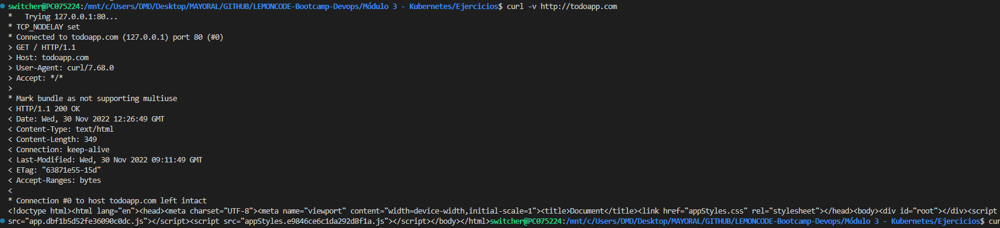

# Ingress

## Enunciado

Construir los distintos recursos de Kubernetes para generar un clúster, como el de la siguiente imagen:


### Para ello seguir los siguientes pasos:

### Paso 1. Crear todo-front.

Crear un `Deployment` para `todo-front`, usar el `Dockerfile` de este directorio **02-distributed/todo-front**, para generar la imagen necesaria. Notar que existe `ARG API_HOST` dentro del fichero `Dockerfile`, lo podemos omitir en este caso, sólo está ahí para poder probar el contenedor de Docker en local.

Al ejecutar un contenedor a partir de la imagen anterior, el puerto expuesto para http es el 80. 

Crear un `Cluster IP Service` que exponga `todo-front` dentro del clúster.

### Paso 2. Crear todo-api.

Crear un `Deployment` para `todo-api`, usar el `Dockerfile` de este directorio **02-distributed/todo-api**, para generar la imagen necesaria.

Al ejecutar un contenedor a partir de la imagen anaterior, el puerto por defecto es el 3000, pero se lo podemos alimentar a partir de  variables de entorono, las variables de entorno serían las siguientes

* **NODE_ENV** : El entorno en que se está ejecutando el contenedor, nos vale cualquier valor que no sea `test`
* **PORT** : El puerto por el que va a escuchar el contenedor

(_Opcional_) Crear un `ConfigMap` que exponga las variables de entorno anteriores. 

Crear un `Cluster IP Service` que exponga `todo-api` dentro del clúster.

### Paso 3. Crear un Ingress para acceder a los servicios del clúster

Crear un `Ingress` para exponer los servicios anteriormente creados. Como referencia para crear este controlardor con `minikube` tomar como referencia el siguiente ejemplo [Set up Ingress on Minikube with the NGINX Ingress Controller](https://kubernetes.io/docs/tasks/access-application-cluster/ingress-minikube/)

## Pasos a seguir:
### Generar imagen docker 
En mi caso he clonado vuestro repositorio https://github.com/Lemoncode/bootcamp-devops-lemoncode.git, una vez estemos posicionados en el siguiente directorio **bootcamp-devops-lemoncode/02-orquestacion/exercises/01-monolith-in-mem/todo-api/** deberemos ejecutar el comando para generar la imagen a partir del dockerfile: 
```bash
docker build -t todo-api .
```
**bootcamp-devops-lemoncode/02-orquestacion/exercises/01-monolith-in-mem/todo-front/** deberemos ejecutar el comando para generar la imagen a partir del dockerfile:
```bash
docker build -t todo-front .
```
### Añadir imagenes docker a minikube
Por otro lado todas estas pruebas las estoy realizando en minikube, dado que al tener la imagen generada en local tenemos este comando de minikube que añade la imagen para poder trabajar con ella:
```bash
minikube image load todo-api

minikube image load todo-front
```
### Generar deployment.yml y aplicar.
En este paso deberemos tener en cuenta añadir los env que vamos a mandar a nuestro container y añadir imagePullPolicy: Never para que no intente descargar dicha imagen de ningún repositorio.
```bash
apiVersion: apps/v1
kind: Deployment
metadata:
  name: todoapi
spec:
  selector:
    matchLabels:
      app: todoapi
  template:
    metadata:
      name: todoapi 
      labels:
        app: todoapi
    spec:
      containers:
      - name: main
        image: todo-api
        imagePullPolicy: Never
        env:
          - name: NODE_ENV
            value: "production"
          - name: PORT
            value: "3000"
        ports:
          - containerPort: 3000
```
Generamos un nuevo deploy para el front.
```bash
apiVersion: apps/v1
kind: Deployment
metadata:
  name: ingress-demo
spec:
  selector:
    matchLabels:
      app: myapp
  template:
    metadata:
      name: myapp 
      labels:
        app: myapp
    spec:
      containers:
      - name: main
        image: todo-front
        imagePullPolicy: Never
        ports:
          - containerPort: 80
```
Para aplicar estos deploy en nuestro cluster de minikube deberemos usar el comando:
```bash
kubectl apply -f deployapi.yml
kubectl apply -f deployfront.yml
```

### Generar services.yml
Por último deberemos crear un servicio tipo ClusterIP teniendo en cuenta poner los puertos de forma correcta.
```bash
apiVersion: v1 
kind: Service
metadata: 
   name: todoapi
spec: 
   selector: 
      app: todoapi 
   ports: 
   - name: http 
     port: 3000 
     targetPort: 3000 
     protocol: TCP
   type: ClusterIP
```
```bash
apiVersion: v1 
kind: Service
metadata: 
   name: todofront
spec: 
   selector: 
      app: myapp
   ports: 
   - name: http 
     port: 80
     targetPort: 80
     protocol: TCP
   type: ClusterIP
```
Para lanzar estos services deberemos ejecutar el siguiente comando:
```bash
kubectl apply -f svc-api.yml

kubectl apply -f svc-front.yml

```

Una vez hayamos realizado todos estos pasos si realizamos una consulta ```curl -v http://todoapp.com/api``` a la api donde nos mostrará lo siguiente respuesta:



Una vez hayamos realizado todos estos pasos si realizamos una consulta ```curl -v http://todoapp.com/``` donde nos mostrará lo siguiente respuesta:


